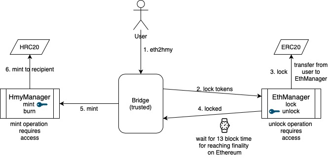
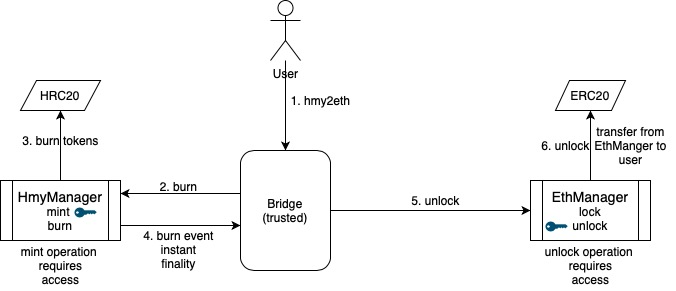

# ethhmy-bridge
Ethereum&lt;>Harmony two way bridge (trusted version)

## Transferring ERC20 from Ethereum to Harmony

## Transferring HRC20 from Harmony back to Ethereum

# Execution Plan

| Milestone | Components                                          | Trust Requirement | Centralization | Target Date    |
|-----------|-----------------------------------------------------|-------------------|----------------|----------------|
| v1        | Smart contracts w/ permissioned mint/unlock         | Trusted           | Centralized    | DONE           |
| v2        | Smart contracts w/ single relayer hosted by harmony | Semi-trusted      | Centralized    | Sept 1, 2020   |
| v3        | Smart contracts w/ a network of relayers            | Trustless         | Decentralized  | Sept 15, 2020  |