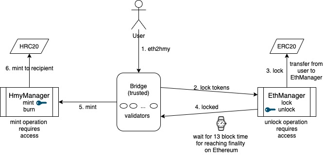
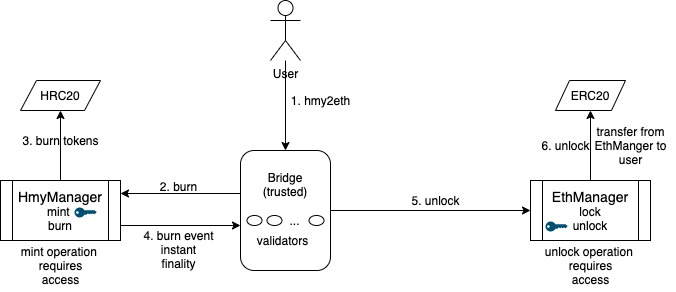

# ethhmy-bridge
Ethereum&lt;>Harmony two way bridge (trusted version)

## Transferring ERC20 from Ethereum to Harmony


## Transferring HRC20 from Harmony back to Ethereum


## Execution Plan

| Milestone | Components                                          | Trust Requirement | Centralization | Target Date    |
|-----------|-----------------------------------------------------|-------------------|----------------|----------------|
| v1        | Smart contracts w/ permissioned mint/unlock         | Trusted           | Centralized    | 25 Sept 2020   |
| v2        | Smart contracts w/ single relayer hosted by harmony | Semi-trusted      | Centralized    | TBD            |
| v3        | Smart contracts w/ a network of relayers            | Trustless         | Decentralized  | TBD            |

## Setup

Create two ropsten accounts and get test tokens using https://faucet.ropsten.be 

Export following variables for ethereum testnet:
```
ETH_NODE_URL='https://ropsten.infura.io/v3/acb534b53d3a47b09d7886064f8e51b6'
ETH_MASTER_PRIVATE_KEY=<private-key-of-first-account-for-deploying-contracts>
ETH_USER_PRIVATE_KEY=<private-key-of-second-account-for-transferring-across-chains>
ETH_USER=<account-address-of-second-eth-account>
ETH_GAS_PRICE=100000000000
ETH_GAS_LIMIT=4712388
```

Create two harmony accounts and get test tokens using https://onefaucet.ibriz.ai

Export following variables for harmony testnet:
```
HMY_NODE_URL='https://api.s0.b.hmny.io'
PRIVATE_KEY=<private-key-of-first-harmony-account-for-deploying-contracts>
PRIVATE_KEY_USER=<private-key-of-second-harmony-account-for-transferring-across-chains>
USER=<hex-account-address-of-the-second-harmony-account>
GAS_LIMIT=6721900
GAS_PRICE=1000000000
```

## Running end to end demo using ethereum ropsten and harmony testnets

```
node scripts/erc20/end2end.js
```

Sample output would look like:

```
Deployed ERC20 contract to 0x10d37ebAecAc162102a12f38b4162a79b70DF6E1
Deployed EthManager contract to 0x93156FF413BD13433C9f84d610B9C317D939Fe0B
HRC20 contract deployed at 0x07e895ee204be18dfa968243113293d57595265f
HmyManager contract deployed at 0x794d9f1227f2632a130b779c477c4de0c30c2ea3
Eth balance of 0x070dA0Ff07Cb324Ac7f208dC8f72Ed0024e849e3: 0
Hmy balance of 0x0B585F8DaEfBC68a311FbD4cB20d9174aD174016 before eth2hmy: 0
Eth balance of 0x070dA0Ff07Cb324Ac7f208dC8f72Ed0024e849e3 after minting: 100
Currently at block 8533537, waiting for block 8533550 to be confirmed
Currently at block 8533537, waiting for block 8533550 to be confirmed
Currently at block 8533538, waiting for block 8533550 to be confirmed
Currently at block 8533539, waiting for block 8533550 to be confirmed
Currently at block 8533541, waiting for block 8533550 to be confirmed
Currently at block 8533546, waiting for block 8533550 to be confirmed
Currently at block 8533550, waiting for block 8533550 to be confirmed
Eth balance of 0x070dA0Ff07Cb324Ac7f208dC8f72Ed0024e849e3 after locking: 0
Hmy balance of 0x0B585F8DaEfBC68a311FbD4cB20d9174aD174016 after eth2hmy: 100
Hmy balance of 0x0B585F8DaEfBC68a311FbD4cB20d9174aD174016 before hmy2eth: 100
Eth balance of 0x070dA0Ff07Cb324Ac7f208dC8f72Ed0024e849e3: 0
Hmy balance of 0x0B585F8DaEfBC68a311FbD4cB20d9174aD174016 after burning: 0
Eth balance of 0x070dA0Ff07Cb324Ac7f208dC8f72Ed0024e849e3 after unlocking: 100
```